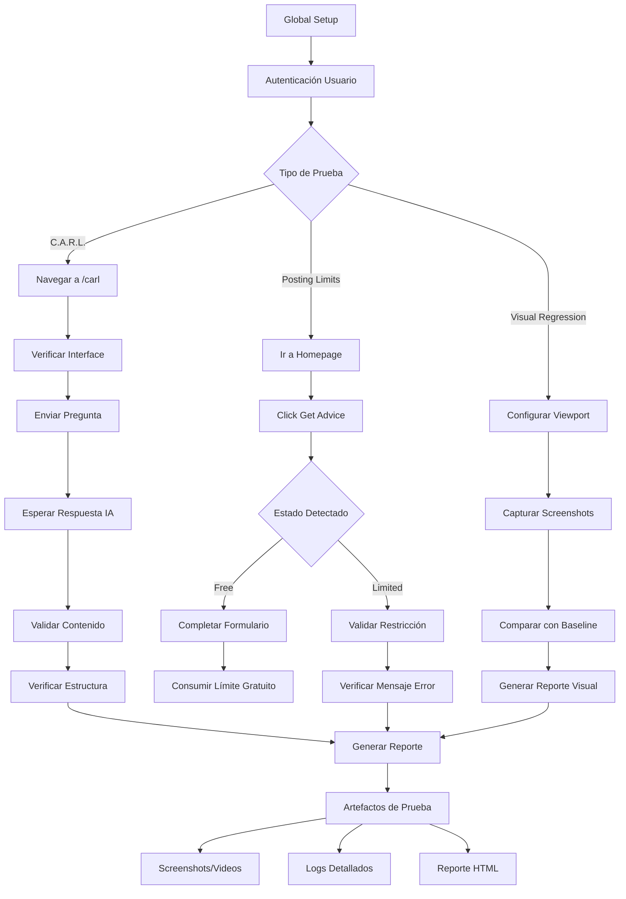
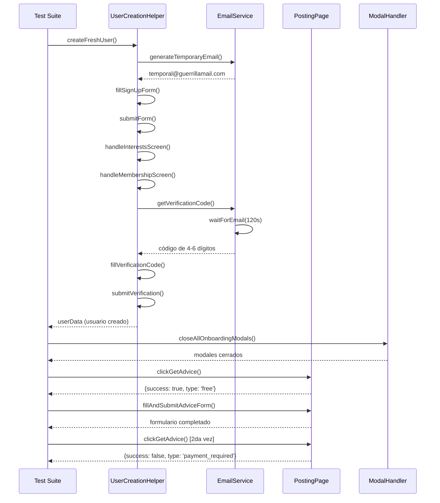
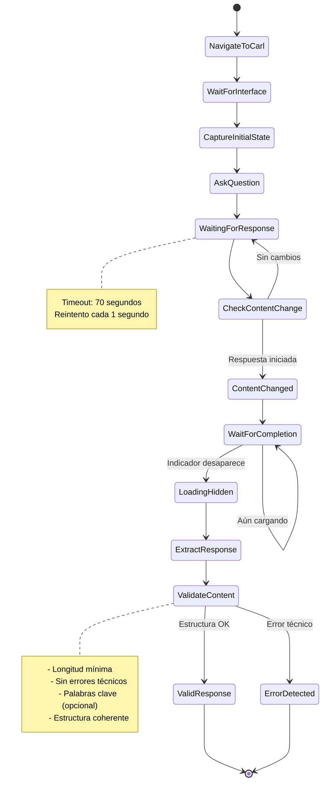

# EPX QA Automation Challenge

## Descripción del Proyecto

Este proyecto implementa una solución de automatización de pruebas para el ecosistema EPX, enfocándose en los casos críticos de QA identificados: validación de flujos de C.A.R.L. (asistente de IA), límites de publicación y comparación visual de interfaces.

El proyecto utiliza Playwright como framework principal con TypeScript, implementando el patrón Page Object Model y helpers especializados para cada dominio de pruebas.

## Casos de Prueba Implementados

### 1. C.A.R.L. - Asistente de IA

**Archivos principales:**

- `test/carl-flujo.spec.ts` - Suite principal de pruebas
- `pages/CarlPage.ts` - Page Object para interacciones con C.A.R.L.
- `test/carl-debug.spec.ts` - Herramientas de debugging

**Validaciones implementadas:**

- Ejecución completa del flujo sin errores técnicos
- Procesamiento correcto de inputs y generación de outputs
- Validación de estructura y contenido de respuestas
- Manejo de múltiples tipos de preguntas (cortas, largas, estructuradas)
- Pruebas de resistencia con múltiples interacciones consecutivas

**Características técnicas:**

- Detección robusta de respuestas completadas
- Extracción inteligente del contenido del asistente
- Validación flexible que se adapta a respuestas variables de IA
- Manejo de timeouts optimizado para respuestas largas

### 2. Límites de Publicación (Posting Limits)

**Archivos principales:**

- `test/posting-limits.spec.ts` - Validación de estado de límites
- `test/posting-limits-fresh-user-simple.spec.ts` - Pruebas con usuarios nuevos
- `pages/PostingPage.ts` - Page Object para funciones de publicación
- `helpers/PostingLimitsHelper.ts` - Lógica especializada

**Validaciones implementadas:**

- Usuario nuevo: 1 Get Advice gratuito por mes
- Máximo 2 posts por mes (segundo requiere pago)
- Detección automática de modales de límite
- Validación de mensajes de error y restricciones
- Flujo completo: creación de usuario → consumo de límite → validación de restricción

**Funcionalidades avanzadas:**

- Creación automatizada de usuarios frescos
- Manejo de verificación de email con servicio temporal
- Detección inteligente de diferentes tipos de límites (upgrade, pago, tiempo)

### 3. Comparación y Documentación Visual

**Archivos principales:**

- `test/visual-regression.spec.ts` - Suite de documentación visual
- `test/visual-comparison.spec.ts` - Prueba de comparación visual automatizada

**Validaciones y Enfoques implementados:**

#### Enfoque 1: Documentación Visual (Implementado)

- Generación automatizada de documentación visual del estado actual de la plataforma.
- Capturas sistemáticas de componentes clave y vistas responsive para análisis manual.
- Este enfoque es ideal para revisiones manuales contra Figma, aceptando la naturaleza dinámica de la UI.

#### Enfoque 2: Comparación Visual Automatizada vs. Figma (Análisis y Retos)

- Se desarrolló una prueba para comparar la UI real contra una imagen de referencia de Figma usando `toHaveScreenshot()` de Playwright.
- **Problema Detectado:** La prueba falla sistemáticamente porque el asset de Figma no es un reflejo 1:1 del DOM real. Las inconsistencias incluyen diferencias de resolución, elementos dinámicos (headers), y estructura incompleta en el diseño.
- **Conclusión:** No es viable ni confiable automatizar la comparación directa contra los assets de Figma actuales. El problema no reside en el código, sino en la estrategia de usar un diseño estático como baseline para un entorno dinámico.

**Características destacadas:**

- Doble estrategia que combina documentación manual con un análisis profundo sobre la viabilidad de la automatización visual.
- Framework escalable para implementar un sistema de baselines basado en el entorno real.
- Evidencias organizadas para análisis de regresiones visuales.

## Arquitectura del Proyecto

### Estructura de Directorios

```plaintext
epx-qa-automation-challenge/
├── test/
│   ├── carl-flujo.spec.ts
│   ├── posting-limits.spec.ts
│   ├── posting-limits-fresh-user-simple.spec.ts
│   ├── visual-regression.spec.ts
│   └── visual-comparison.spec.ts
├── pages/
│   ├── BasePage.ts
│   ├── CarlPage.ts
│   ├── LoginPage.ts
│   └── PostingPage.ts
├── helpers/
│   ├── UserCreationHelper.ts
│   ├── GuerrillaEmailService.ts
│   ├── ModalHandler.ts
│   ├── PostingLimitsHelper.ts
│   └── VisualTestHelper.ts
├── fixtures/
├── global-setup.ts
└── playwright.config.ts
```

## Patrones de Diseño Implementados

- **Page Object Model**: Cada página tiene su clase dedicada con locators y métodos específicos.
- **Helper Classes**: Servicios especializados para funcionalidades complejas como creación de usuarios y manejo de emails.
- **Base Page Pattern**: Clase base con funcionalidades comunes (navegación, esperas, validaciones).
- **Global Setup**: Autenticación centralizada que evita login repetitivo en cada test.

## Configuración y Ejecución

### Prerrequisitos

- Bash
- Node.js >= 18
- npm >= 8

### Instalación

```bash
# Clonar el repositorio
git clone https://github.com/jogonzal79/epx-qa-automation-challenge.git
cd epx-qa-automation-challenge

# Instalar dependencias
npm install

# Instalar navegadores de Playwright
npx playwright install chromium
```

### Variables de Entorno

Crear archivo `.env` en la raíz del proyecto:

```env
EPX_EMAIL=correo_registrado
EPX_PASS=password
CAPTCHA_API_KEY=tu_clave_2captcha  # Opcional, para automatización completa
```

### Comandos de Ejecución

```bash
# Ejecutar todas las pruebas
npm test

# Pruebas específicas de C.A.R.L.
npm run test:carl

# Pruebas de límites de publicación
npm run test:posting

# Actualizar snapshots de referencia (baseline)
npm run test:visual:update

# Modo debug con interfaz gráfica
npm run debug:carl
npm run test:posting:debug

# Ver reporte HTML
npm run report
```

## Enfoques de Automatización

### Playwright + TypeScript (Implementado)

**Ventajas:**

- Control total sobre el flujo de pruebas
- Debugging avanzado y trazabilidad
- Integración nativa con TypeScript
- Manejo robusto de elementos dinámicos
- Screenshots y videos automáticos en fallos

**Casos de uso óptimos:**

- Flujos complejos que requieren múltiples pasos
- Validación de lógica de negocio específica
- Integración con servicios externos (email, captcha)
- Pruebas que requieren estado persistente

**Pruebas Visuales:**

La comparación directa con Figma demostró ser inviable.

**Enfoque recomendado:** Utilizar Playwright para generar snapshots de referencia desde la propia aplicación. Una vez que el equipo certifica manualmente que la UI es correcta, se ejecuta `npx playwright test --update-snapshots` para establecer un baseline confiable. Las ejecuciones futuras compararán contra este baseline para detectar regresiones visuales de forma precisa.

## Resultados y Evidencias

### Cobertura de Casos de Prueba

- **C.A.R.L. Flujos:** 5 escenarios principales cubiertos.
- **Posting Limits:** Validación completa del ciclo gratuito → límite.
- **Visual Testing:**
  - Documentación Visual: 6 componentes clave documentados en múltiples viewports.
  - Análisis de Viabilidad: Demostración práctica de los retos de la comparación automatizada vs. Figma, concluyendo en un enfoque más robusto basado en snapshots del entorno real.

## Diagrama General del Proceso



## Flujo Usuario Fresco (Posting Limits)



## Flujo C.A.R.L. (Validación IA)



## Recomendaciones para Producción

- Automatización completa para flujos críticos y repetitivos (C.A.R.L., Posting Limits).
- Verificación manual o semi-automatizada para la validación de consistencia visual contra nuevos diseños de Figma.
- Pruebas visuales automatizadas (Regression Testing) en entornos controlados, utilizando baselines generados desde la propia aplicación, no desde Figma. Estas pruebas deben excluirse del flujo principal de CI/CD para evitar falsos positivos y gestionarse en un proceso aparte.

## Conclusiones

Este proyecto demuestra una implementación robusta de automatización de QA que no solo cubre los casos de prueba solicitados, sino que también realiza un análisis técnico profundo sobre la viabilidad y los desafíos de las pruebas visuales automatizadas.

La solución proporciona una base sólida para asegurar la calidad del ecosistema EPX, destacando:

- **Cobertura Funcional:** Validación exhaustiva de C.A.R.L. y los límites de publicación.
- **Análisis Técnico:** Se identificó que la comparación directa con Figma no es confiable y se propuso una estrategia de regresión visual más robusta y estándar en la industria.
- **Mantenibilidad y Escalabilidad:** Una arquitectura limpia que facilita la evolución y la adición de nuevas pruebas.
