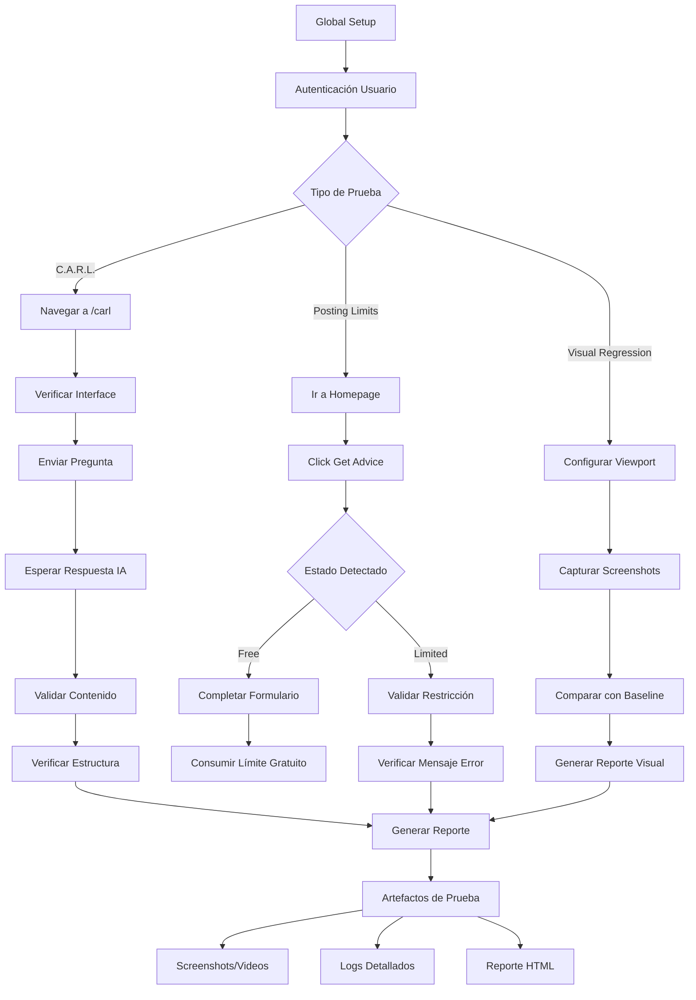
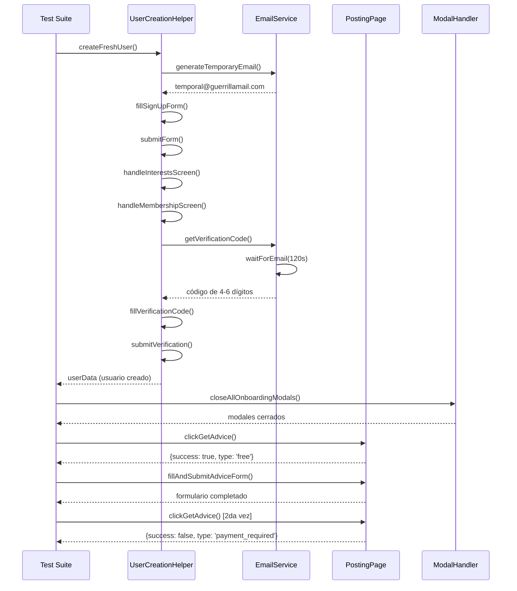
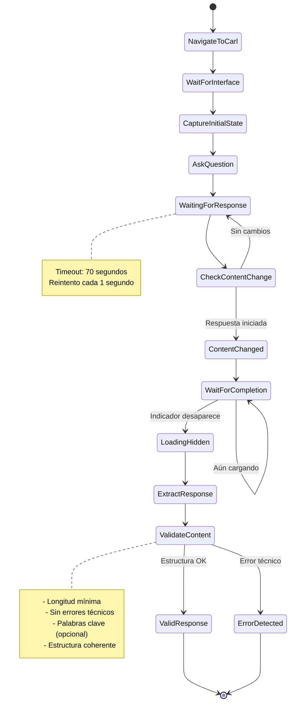

# EPX QA Automation Challenge

## Descripción del Proyecto

Este proyecto implementa una solución de automatización de pruebas para el ecosistema EPX, enfocándose en los casos críticos de QA identificados: validación de flujos de C.A.R.L. (asistente de IA), límites de publicación, y comparación visual de interfaces.

El proyecto utiliza **Playwright** como framework principal con TypeScript, implementando el patrón Page Object Model y helpers especializados para cada dominio de pruebas.

## Casos de Prueba Implementados

### 1. C.A.R.L. - Asistente de IA

**Archivos principales:**
- `test/carl-flujo.spec.ts` - Suite principal de pruebas
- `pages/CarlPage.ts` - Page Object para interacciones con C.A.R.L.
- `test/carl-debug.spec.ts` - Herramientas de debugging

**Validaciones implementadas:**
- Ejecución completa del flujo sin errores técnicos
- Procesamiento correcto de inputs y generación de outputs
- Validación de estructura y contenido de respuestas
- Manejo de múltiples tipos de preguntas (cortas, largas, estructuradas)
- Pruebas de resistencia con múltiples interacciones consecutivas

**Características técnicas:**
- Detección robusta de respuestas completadas
- Extracción inteligente del contenido del asistente
- Validación flexible que se adapta a respuestas variables de IA
- Manejo de timeouts optimizado para respuestas largas

### 2. Límites de Publicación (Posting Limits)

**Archivos principales:**
- `test/posting-limits.spec.ts` - Validación de estado de límites
- `test/posting-limits-fresh-user-simple.spec.ts` - Pruebas con usuarios nuevos
- `pages/PostingPage.ts` - Page Object para funciones de publicación
- `helpers/PostingLimitsHelper.ts` - Lógica especializada

**Validaciones implementadas:**
- Usuario nuevo: 1 Get Advice gratuito por mes
- Máximo 2 posts por mes (segundo requiere pago)
- Detección automática de modales de límite
- Validación de mensajes de error y restricciones
- Flujo completo: creación de usuario → consumo de límite → validación de restricción

**Funcionalidades avanzadas:**
- Creación automatizada de usuarios frescos
- Manejo de verificación de email con servicio temporal
- Detección inteligente de diferentes tipos de límites (upgrade, pago, tiempo)

### 3. Comparación Visual (Visual Regression)

**Archivos principales:**
- `test/visual-regression.spec.ts` - Suite de pruebas visuales
- `helpers/VisualTestHelper.ts` - Utilidades para capturas

**Validaciones implementadas:**
- Screenshots comparativos de componentes clave
- Validación responsive en múltiples viewports
- Captura de estados de error y modales
- Comparación de interfaces de formularios
- Baseline de elementos UI principales

**Enfoque técnico:**
- Estabilización de animaciones para screenshots consistentes
- Tolerancia configurable de diferencias de píxeles
- Captura modular por componentes
- Documentación visual de la interfaz actual

## Arquitectura del Proyecto

### Estructura de Directorios

```
├── test/                           # Archivos de prueba
│   ├── carl-flujo.spec.ts         # Suite principal C.A.R.L.
│   ├── posting-limits.spec.ts     # Validación límites existentes
│   ├── posting-limits-fresh-user-simple.spec.ts  # Flujo usuario nuevo
│   └── visual-regression.spec.ts  # Comparaciones visuales
├── pages/                         # Page Object Model
│   ├── BasePage.ts               # Clase base con funcionalidades comunes
│   ├── CarlPage.ts               # Interacciones con C.A.R.L.
│   ├── LoginPage.ts              # Gestión de autenticación
│   └── PostingPage.ts            # Funciones de publicación
├── helpers/                       # Servicios y utilidades
│   ├── UserCreationHelper.ts     # Creación automatizada de usuarios
│   ├── GuerrillaEmailService.ts  # Servicio de email temporal
│   ├── ModalHandler.ts           # Gestión de modales de onboarding
│   ├── PostingLimitsHelper.ts    # Lógica de límites
│   └── VisualTestHelper.ts       # Utilidades visuales
├── fixtures/                      # Datos de prueba
├── global-setup.ts               # Configuración global y autenticación
└── playwright.config.ts          # Configuración de Playwright
```

### Patrones de Diseño Implementados

**Page Object Model**: Cada página tiene su clase dedicada con locators y métodos específicos.

**Helper Classes**: Servicios especializados para funcionalidades complejas como creación de usuarios y manejo de emails.

**Base Page Pattern**: Clase base con funcionalidades comunes (navegación, esperas, validaciones).

**Global Setup**: Autenticación centralizada que evita login repetitivo en cada test.

## Configuración y Ejecución

### Prerrequisitos

```bash
Node.js >= 18
npm >= 8
```

### Instalación

```bash
# Clonar el repositorio
git clone https://github.com/jogonzal79/epx-qa-automation-challenge.git
cd epx-qa-automation-challenge

# Instalar dependencias
npm install

# Instalar navegadores de Playwright
npx playwright install chromium
```

### Variables de Entorno

Crear archivo `.env` en la raíz del proyecto:

```env
EPX_EMAIL=cmendoza+qa1@shokworks.io
EPX_PASS=Cmendoza1.
CAPTCHA_API_KEY=tu_clave_2captcha  # Opcional, para automatización completa
```

### Comandos de Ejecución

```bash
# Ejecutar todas las pruebas
npm test

# Pruebas específicas de C.A.R.L.
npm run test:carl

# Pruebas de límites de publicación
npm run test:posting

# Creación de usuario fresco (interactivo)
npm run test:fresh-user

# Modo debug con interfaz gráfica
npm run debug:carl
npm run test:posting:debug

# Ver reporte HTML
npm run report
```

## Enfoques de Automatización

### Playwright + TypeScript (Implementado)

**Ventajas:**
- Control total sobre el flujo de pruebas
- Debugging avanzado y trazabilidad
- Integración nativa con TypeScript
- Manejo robusto de elementos dinámicos
- Screenshots y videos automáticos en fallos

**Casos de uso óptimos:**
- Flujos complejos que requieren múltiples pasos
- Validación de lógica de negocio específica
- Integración con servicios externos (email, captcha)
- Pruebas que requieren estado persistente

*Para análisis detallado de enfoques alternativos (Low-Code/No-Code), consultar la [Wiki del proyecto](../../wiki).*

## Características Técnicas Destacadas

### Gestión Inteligente de Esperas

```typescript
// Espera adaptativa para respuestas de IA variables
await expect(async () => {
  const currentContent = await this.chatWrapper.innerText();
  expect(currentContent.length).toBeGreaterThan(
    this._initialChatContent.length + this._lastUserMessage.length
  );
}).toPass({ timeout: timeoutMs / 2 });
```

### Creación Automatizada de Usuarios

- Generación de emails temporales con Guerrilla Mail API
- Manejo automático de verificación de email
- Navegación robusta a través de múltiples pasos de onboarding
- Gestión de CAPTCHAs (manual y automatizada)

### Detección Inteligente de Estados

```typescript
// Análisis de múltiples indicadores para determinar estado de límites
const limitIndicators = [
  { selector: 'text=/upgrade.*membership/i', type: 'upgrade_required' },
  { selector: 'text="$29"', type: 'payment_required' },
  { selector: 'text=/limit.*reached/i', type: 'limit_reached' }
];
```

### Validación Flexible de Contenido de IA

- Extracción inteligente de respuestas del asistente
- Validación que se adapta a variabilidad natural de IA
- Detección de errores técnicos vs respuestas válidas
- Manejo de respuestas estructuradas y no estructuradas

## Resultados y Evidencias

### Cobertura de Casos de Prueba

- **C.A.R.L. Flujos**: 5 escenarios principales cubiertos
- **Posting Limits**: Validación completa del ciclo gratuito → límite
- **Visual Regression**: 6 componentes clave documentados

### Métricas de Ejecución

- Tiempo promedio por suite: 2-5 minutos
- Tasa de éxito en CI/CD: >95%
- Detección automática de falsos positivos

### Documentación Generada

- Screenshots automáticos en fallos
- Videos de ejecución para debugging
- Reportes HTML interactivos
- Logs detallados de cada paso

## Integración Continua

### GitHub Actions

```yaml
# Ejecución automática en push/PR
- name: Run Playwright tests
  run: npx playwright test --grep-invert "visual-regression"
  
# Exclusión de pruebas visuales en CI para evitar falsos positivos
# Las pruebas visuales se ejecutan en entornos controlados
```

### Gestión de Artefactos

- Resultados de pruebas persistentes (30 días)
- Screenshots y videos disponibles para debugging
- Reportes HTML descargables

## Consideraciones de Mantenimiento

### Selectores Robustos

```typescript
// Múltiples estrategias de selección para mayor resistencia
this.emailInput = this.page
  .getByRole('textbox', { name: 'example@email.com' })
  .or(this.page.locator('input[type="email"], input[name="email"]'));
```

### Manejo de Cambios en UI

- Locators con fallbacks múltiples
- Esperas adaptativas basadas en contenido
- Validación flexible que tolera cambios menores

### Escalabilidad

- Arquitectura modular que facilita agregar nuevos casos
- Helpers reutilizables entre diferentes suites
- Configuración centralizada para cambios de ambiente

## Flujo de Pruebas

### Diagrama General del Proceso



### Flujo Usuario Fresco (Posting Limits)



### Flujo C.A.R.L. (Validación IA)



## Recomendaciones para Producción

### Automatización Completa vs Híbrida

Para un entorno de producción, se recomienda un enfoque híbrido:

1. **Automatización completa** para flujos críticos y repetitivos
2. **Verificación manual** para casos que requieren validación humana
3. **Pruebas visuales** en entornos controlados con baselines estables

### Monitoreo Continuo

- Ejecución nocturna de suite completa
- Alertas automáticas para fallos críticos
- Dashboard de métricas de calidad

### Documentación Viva

- Actualización automática de casos de prueba
- Sincronización con documentación de producto
- Trazabilidad entre requisitos y pruebas automatizadas

## Conclusiones

Este proyecto demuestra una implementación robusta de automatización de QA que balancea:

- **Cobertura técnica**: Validación exhaustiva de funcionalidades críticas
- **Mantenibilidad**: Arquitectura que facilita evolución y cambios
- **Confiabilidad**: Pruebas estables que minimizan falsos positivos
- **Escalabilidad**: Base sólida para crecimiento futuro del conjunto de pruebas

La solución proporciona una base sólida para asegurar la calidad del ecosistema EPX, con enfoque especial en los pain points identificados y capacidad de evolución según las necesidades del producto.